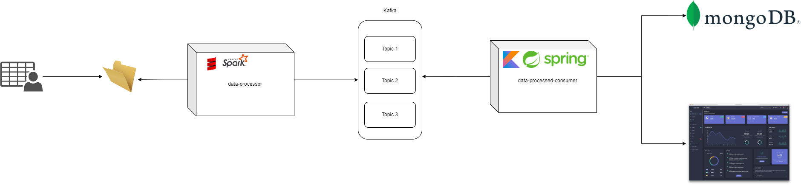

# PFSD PROJECT DATA CONSUMER
Como parte de la solución propuesta para soluciónar la necesidad de la organización
**Armirene** para disminuir los tiempos que demoran actualmente en calcular sus metricas,
se realizaron dos servicios los cuales se encarga de generar dicha información a partir
de una arquitectura orientada por eventos.

La arquitectura completa del proyecto es la siguiente:


## Instrucciones
1. Primero debe levantar el contenedor de [docker](docker/kafka/docker-compose.yaml)
   creado para levantar una instancia de Mongo ya que este proyecto hace uso de esto.

2. Ejecutar los siguientes comandos desde la consola de MongoDB para crear el usuario y las
colecciones necesarias de este proyecto:
```
use use pfsd-project-db

db.createUser({
   user: "project-user",
   pwd: "oXvxcuJejcjAoY8TRYaK",
   roles: [{ role: "readWrite", db: "pfsd-project-db" }]
})


db.createCollection("managed-orders-per-day-by-city")
db.createCollection("managed-orders-per-day-by-store")
db.createCollection("orders-placed-against-no-placed-per-day")
db.createCollection("orders-placed-against-no-placed-per-month")
db.createCollection("orders-placed-metrics-per-day")
db.createCollection("orders-placed-metrics-per-month")
```

3. Correr el proyecto Spring Boot.